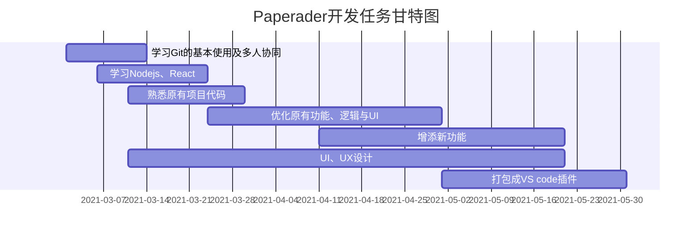

## Paperadar任务安排与完成情况

* 第0周
    > + 预期目标规划
    > > - [x] 叶舟
    > > - [x] 陈浩琨
    > > - [x] 赵婉羽
    > > - [x] 郁浩元
* 第1周
    > + Git的基本用法学习
    > > - [ ] 叶舟
    > > - [ ] 陈浩琨
    > > - [ ] 赵婉羽
    > > - [ ] 郁浩元
    > + Node.js入门
    > > - [ ] 叶舟
    > > - [ ] 陈浩琨
    > > - [ ] 赵婉羽
    > > - [ ] 郁浩元