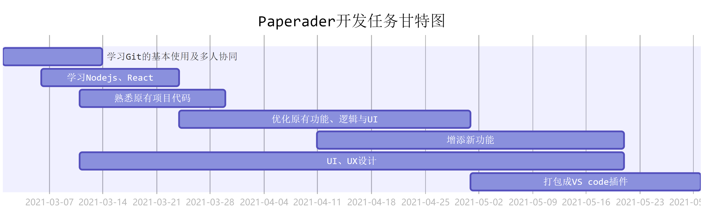

## Paperadar任务安排与完成情况

* 第0周（02.22-02.28）
    > + 预期目标规划
    > > - [x] 叶舟
    > > - [x] 陈浩琨
    > > - [x] 赵婉羽
    > > - [x] 郁浩元
* 第1周（03.01-03.07）
    > + Git的基本用法学习
    > > - [x] 叶舟
    > > - [x] 陈浩琨
    > > - [x] 赵婉羽
    > > - [x] 郁浩元
    > + Node.js入门
    > > - [x] 叶舟
    > > - [x] 陈浩琨
    > > - [x] 赵婉羽
    > > - [x] 郁浩元
* 第2周（03.08-03.14）
    > + Git的多人协同学习
    > > - [x] 叶舟
    > > - [ ] 陈浩琨
    > > - [x] 赵婉羽
    > > - [x] 郁浩元
    > + Node.js学习、开始熟悉代码
    > > - [x] 叶舟
    > > - [x] 陈浩琨
    > > - [x] 赵婉羽
    > > - [x] 郁浩元
    > + UI重构初步设计
    > > - [x] 叶舟
* 第3周（03.15-03.21）
    > + Node.js&React学习、熟悉代码
    > > - [x] 叶舟
    > > - [ ] 陈浩琨
    > > - [x] 赵婉羽
    > > - [x] 郁浩元
    > + UI重构设计
    > > - [x] 叶舟
    > + pdf.js探索
    > > - [ ] 陈浩琨
* 第4周（03.22-03.28）
    > + Node.js&React学习收尾、熟悉代码
    > > - [x] 叶舟
    > > - [ ] 陈浩琨
    > > - [x] 赵婉羽
    > > - [x] 郁浩元
    > + UI重构设计
    > > - [x] 叶舟
    > + 初步着手重构
    > > - [x] 叶舟
    > > - [ ] 陈浩琨
    > > - [ ] 赵婉羽
    > > - [ ] 郁浩元

- 第5周（03.29-04.04）
    > + 熟悉代码
    > > - [x] 叶舟
    > > - [ ] 陈浩琨
    > > - [ ] 赵婉羽
    > > - [ ] 郁浩元
    > + UI重构设计
    > > - [x] 叶舟
    > + 后端规划
    > > - [x] 叶舟
    > + 开始重构
    > > - [ ] 陈浩琨
    > > - [ ] 赵婉羽
    > > - [ ] 郁浩元
- 第6周（04.05-04.11）
    > + UI重构设计
    > > - [x] 叶舟
    > + 后端设计（域名、数据库配置）
    > > - [x] 叶舟
    > + 客户端重构
    > > - [ ] 陈浩琨
    > > - [ ] 赵婉羽
    > > - [ ] 郁浩元
- 第7周（04.12-04.18）
    > + 后端接口编写
    > > - [ ] 叶舟
    > + 客户端重构
    > > - [ ] 陈浩琨
    > > - [ ] 赵婉羽
    > > - [ ] 郁浩元